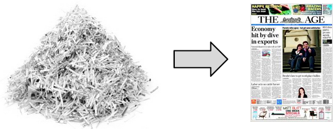

# Introduction {#introduction}

Genome assembly has been regarded as one of the most important and most challenging problems in bioinformatics, perhaps at least since the late 80's, when the Human Genome Project was announced. Due to exponential growth of technology this topic is still relevant and there are still quite a few problems we have to face.

Genomes tend to be almost inconceivably long. Human DNA for example is approximately thousand times longer than the Bible (letter-wise), and some species have their genomes even orders of magnitude longer. Yet the algorithmic part of the problem arises not mainly because of the length. This was definitely the case for the biotechnologicians, who few decades ago were constrained within low-thorughput sequencing techniques. For bioinformaticians though the core of the problem is located a bit deeper.

Good analogy, that explains the nature of our challenge, is a shredded newspaper (some authors call it the newspaper problem, others use book as an example). Namely, genome assembly resembles reconstruction of the original document from a set of unarranged newspaper pieces, like on the figure below. 

As one can imagine the problem is difficult, but not because the newspaper is twenty or forty pages long. With just a single sheet the task still wouldn't be easy. The length of the genome, although far from being irrelevant, for us is more of a secondary issue. On the other hand, repetitive patterns, which for biotechnologicians are not a problem at all, will complicate our journey substantially. 

One should also underline the fact that transcriptome assembly is not the same as the genome assembly. Read coverage of the latter is relatively uniform, whereas transcriptome can be differentially expressed and therefore the frequency of its reads varies a lot. In genome assembly non-uniform abundance of the reads simply indicates presence of repetitive patterns. In the case of transcription product it is much less straightforward. Methods that overcome this issue exist but they are beyond of the scope of this textbook.