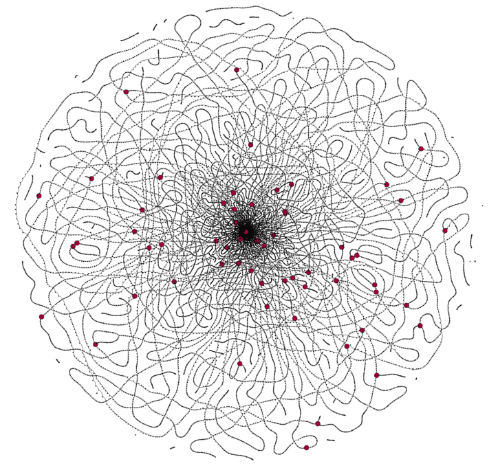

--- 
title: "Genome Assembly"
author: "officialprofile"
date: "`r Sys.Date()`"
site: bookdown::bookdown_site
documentclass: book
bibliography: [book.bib, packages.bib]
url: https://github.com/officialprofile/Genome-assembly/
description: "Low-level approach to genome de novo assembly"
biblio-style: apalike
csl: chicago-fullnote-bibliography.csl
---

# Preface

This mini textbook describes selected algorithms that play a main role in the de novo genome assembly. The premise of this book is to construct these algorithms from the very bottom and explain step by step main ideas that stand behind them.

We will try to avoid as much as possible ready-to-use implementations, which are of course available and of great quality, but their use wouldn't serve the educational purpose. Naturally, many applications are included as well.

By default the code is written in R, but at certain points python is also mentioned.

```{r, fig.align = 'center', echo=FALSE, out.width = '80%'}

```
<font size="1">A HiFi De Bruijn graph for a pile of reads from Drosophila genome sequencing. Each dot represents a k-mer (k=23), the edges denote neighboring k-mers. The larger red dots mark the head of heterozygous bubbles. Source: pacb.com.</font> 

## Prerequisites

It is assumed that the reader

1. has a basic understanding of genetics;

2. has some experience with programming in R (is familiar with loops, data structures, etc.)

3. had some contact with higher mathematics, e.g. statistics, graph theory. 

Throughout the book the following libraries are being used and it is assumed that the reader has them loaded.
```{r eval = FALSE}
library(stringr)
library(dplyr)
library(igraph)
```
 
```{r include=FALSE}
# automatically create a bib database for R packages
knitr::write_bib(c(
  .packages(), 'bookdown', 'knitr', 'rmarkdown', 'stringr', 'dplyr', 'igraph'
), 'packages.bib')
```
