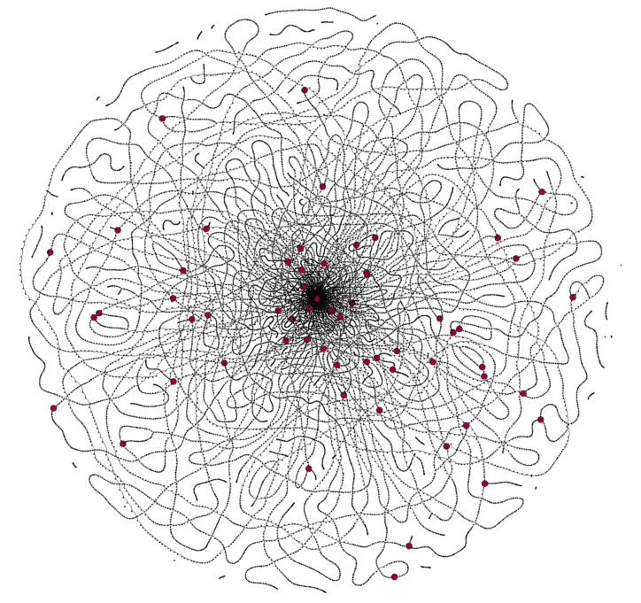

## Genome Assembly. Low-level approach with R 

[**Read the textbook online**](https://officialprofile.github.io/Genome-assembly/) | **Download** [**PDF**](https://github.com/officialprofile/Genome-assembly/raw/main/Genome-Assembly.pdf) **or** [**epub**](https://github.com/officialprofile/Genome-assembly/raw/main/Genome-Assembly.epub) **version** | [Track the progress of this project](https://github.com/users/officialprofile/projects/2)

This mini textbook describes (or perhaps one should say "will describe") selected algorithms that play a vital role in the de novo genome assembly or in some related areas. The premise of this book is to construct these algorithms from the very bottom along with brief explanation of their gists. Naturally, the applications are included as well. By default the code is written in R, but python and shell can appear at some point as well (not very likely though).

It is assumed that the reader:

- Has a basic understanding of genetics.
- Has some experience with programming in R (knows the pipe operator, etc.)
- Had some contact with higher mathematics, e.g. statistics, graph theory.

